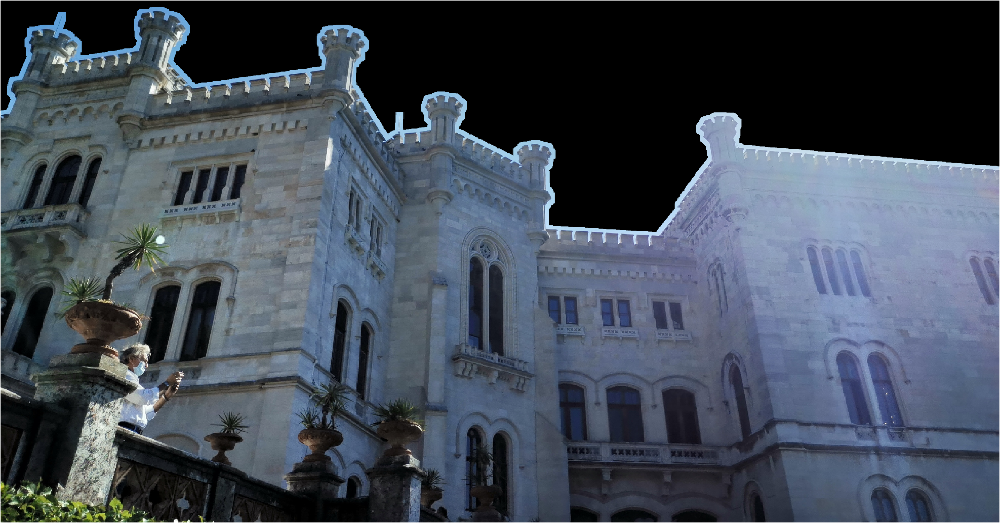
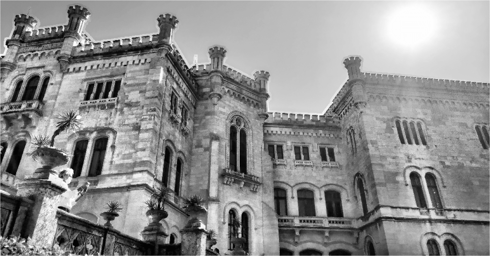
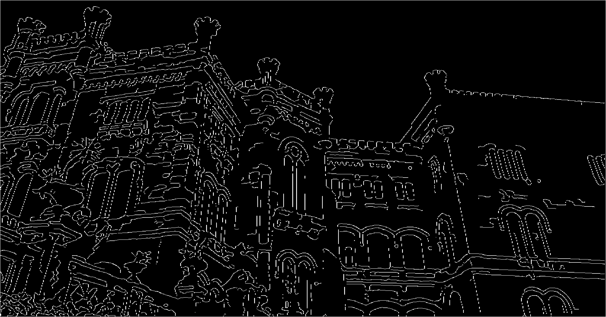
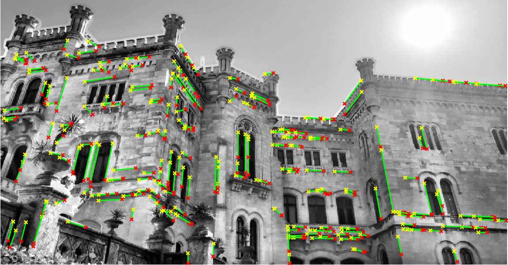
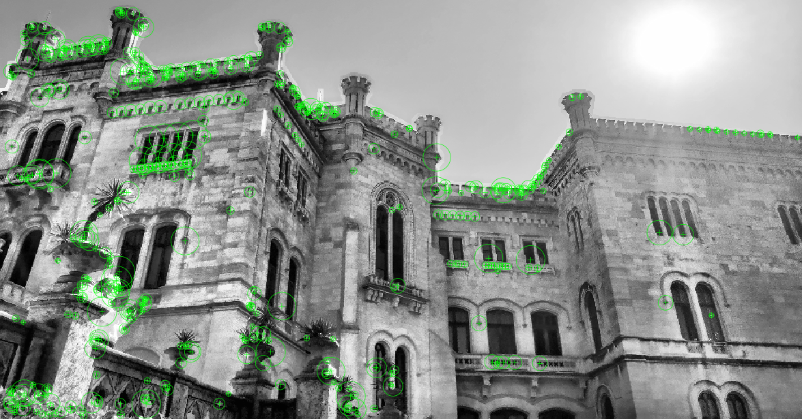
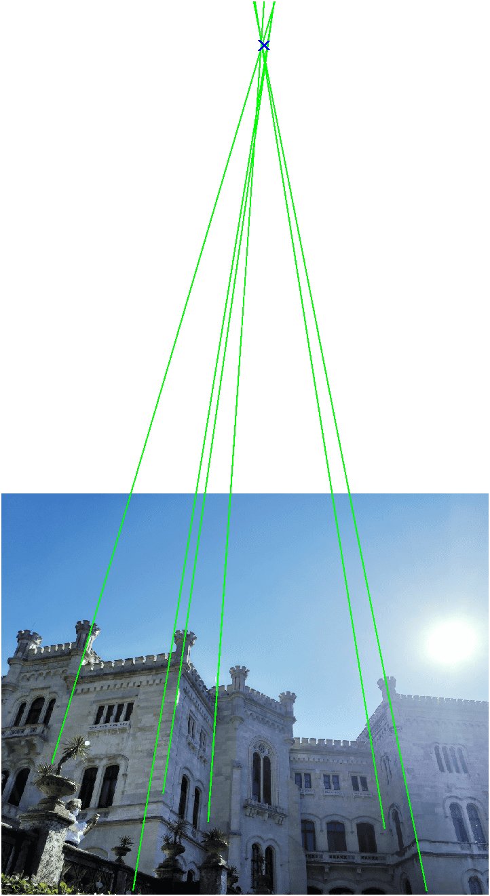
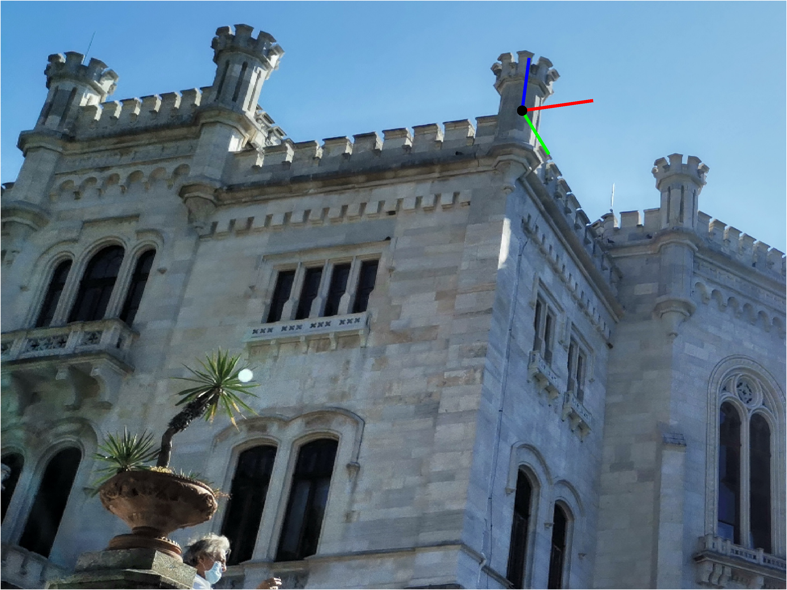
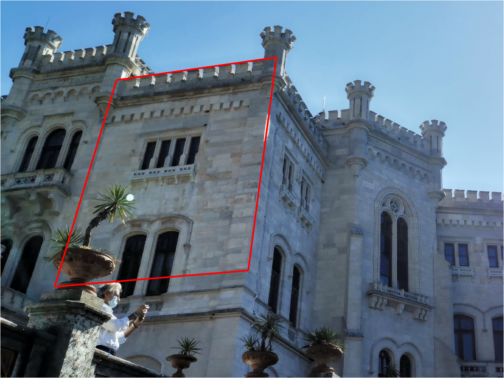
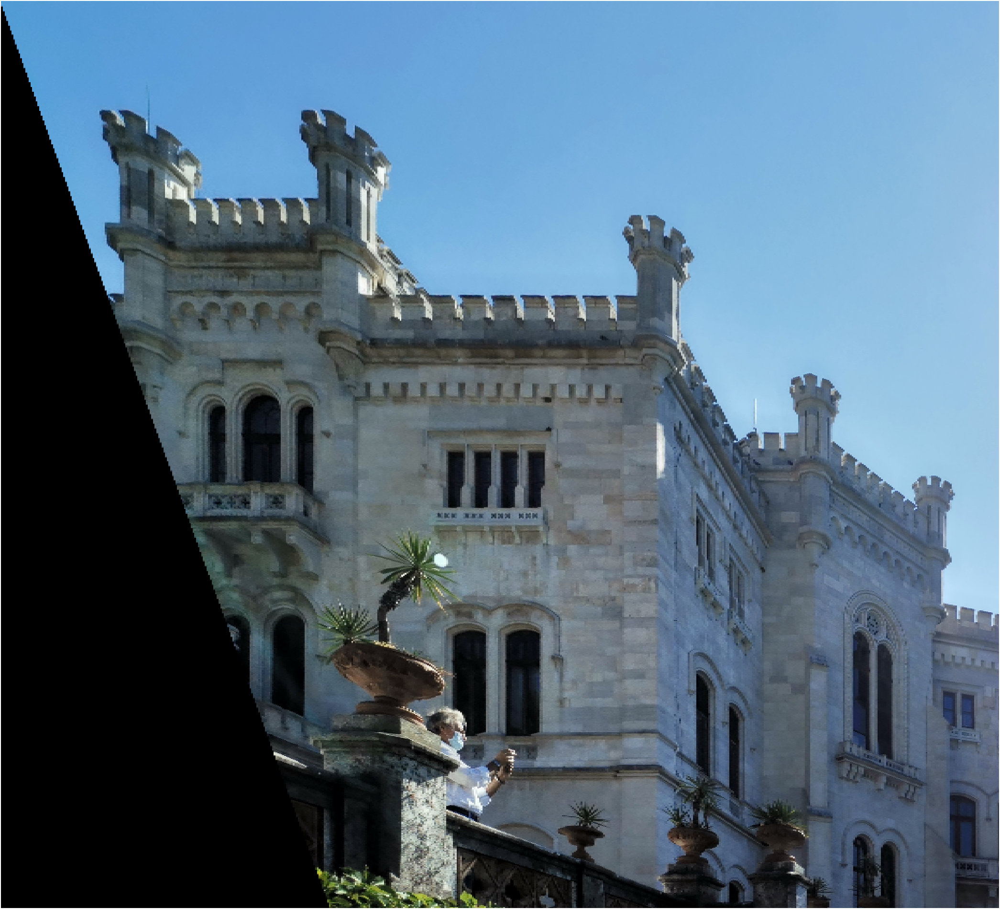

# IACV homework

## Image processing ([`processing.m`](./processing.m))

### F1 - Feature extraction

First thing I cropped the image to reduce sky area which is useless in the feature detection process.

#### Sky mask

Before adjust the image contrast, I tried to remove as much sky as possible, which could reduce the quality of the contrast improvement.
I changed the space color of the image to the *HSV* then I selected only a small subset of the value *V*;
in order to improve the quality of the mask I applied an iteration of `imdilate` to remove the small blob. So I got a sky mask.

{height=250px}

#### Edges detection

Before to apply the `canny` function we need to define one channel image; I tried some method to convert 3 channels image to one channel image, some of them using a single channel of a specific space color as **HSV**, but in finally I decided to use the classical conversion to the gray scale image due to the inadequate results of other methods.
Then I tried to enhance the image contrast apply on it an adaptive histogram equalization exploiting method `adapthisteq`, because of the high exposition of the sky I have to limit the area of the histogram equalization to the castle only (excluding the sky), to do this I used the sky mask previously computed with the exploiting `roifilt2` function.

{height=250px}

As last step before apply the edge detection algorithm I decided to rescale the image to reduce its size;
this behaviour showed to improve the quality of the edge detection and the following lines' detection.
Then I did the edge detection exploiting the `canny` algorithm: this algorithm, different to the other differentiation methods, returns a binary image composed by lines, this result simplify the application of the lines' detection exploiting the **Hough transformation**.
I tuned the `canny` algorithm parameters with the hysteresis thresholds of $\begin{bmatrix} 0.1 & 0.2 \end{bmatrix}$ and a sigma of the **Gausian filter** of $3$.

{height=250px}

#### Lines detection

In order to detect the lines in the image I used the **Hough transformation**, this transformation, for each point in the image (in this case the edges image), defines a family of intersecting straight lines that in parametric plane (given by the pairs $(\rho, \theta)$ of the parametric line $\rho = x \cos(\theta) + y \sin(\theta)$) is a curve.
The plane is used as an accumulator, fitted with all the parameters pairs got from the points of the edges image, then the lines in the image are identified as the peaks of the parametric plane.

Due to the preprocessing I could maintain parameters like the default ones for the `hough` function, I set the resolution of theta as $1^\circ$ and the rho resolution to $1$.
I set a limits of 300 peaks from the parametric plane and a neighbours' suppression to $\begin{bmatrix} 15 & 15 \end{bmatrix}$ to reduce similar results.
Finally, I retrieved the segments lines with the `houghlines` function setting a max gap between two points on the same line of $8$ pixels and the minimum length of a segment line of $25$ pixels.

{height=250px}

#### Features detection

For this step I decided to apply only the histogram equalization on the image after the conversion to the gray scale.
To detect the images features I tried several algorithms, then I chose the **SURF** one which produces the best result (several algorithms detect features only on the battlement).

{height=250px}

## Geometry ([`geometry.m`](./geometry.m))

### Functions and class

To simplify the developing of the required result I chose to write some classes and functions.

#### Class

- `HX`
  
    Represents a homogeneous vector. The multiplication between two `HW` instances is interpreted as a cross product, moreover provides some function to draw as line or point.

- `Seg`
  
    Represents a line segment. It provides method `line` to retrieve the associated line.
  
- `SegGroup`

    Represents a group of line segments. The method `find_vanish_point` finds the intersection point of the lines as an optimization problem.

#### Functions

- `get_normalized_transformation`
    
    Given a set of homogeneous points returns a similar transformation to normalize them. 

### G1 - 2D reconstruction

*Due to the experimental results I decided to include some hand-taken lines to improve the accuracy of the calculations.*

#### Recovery of the affine properties

To recover the affine properties of the images we have to put back the line at infinity in the image to its canonical position $\begin{bmatrix}0&0&1\end{bmatrix}^T$.
In order to do it we need to compute the infinity line for the plane $\Pi$ in the image, on this line lie all the vanish point s given by the parallel lines of the plane $\Pi$. So, I choice to compute the vanish points for the facade on which there are the line segments 2, 3 and 5 (the vanish point of the facades 1, 4 and 6  would introduce too much uncertainty, because the lines lie on them are almost parallel).

So I selected some lines parallel to plane $\Pi$ on the facades 2, 3 and 5; for each plane I created an instance of `SegGroup` to group the parallel line segments. With the method `find_vanish_point` I retrieve the vanish points corresponding to the three lines groups.

{height=250px}

The `find_vanish_point` sets the problem to find the vanish point as a minimization one. We know that a point $p$ on a line $l$ solves the relation $l^Tp=0$, thus the lines are collected in a matrix $L=\begin{bmatrix}l_1 & l_2 & \dots\end{bmatrix}^T$ where the best approximation fot the vanish point is the point $v$ that minimize the relation $\lVert Lv \rVert$.
The point $v$ that minimize the error is found exploiting the *least squares solution of homogeneus equation*  as the last column of the matrix $V$ getting from the *singular value decomposition* of the matrix $L$.
*In order to reduce the error given by the `svd` function, the line coordinates are normalized rescaling them around zero.*

 

Found the 3 vanish points I use them to find the infinity line in the image, which have to pass to all the three vanish points. Due to the noise the infinity line cannot satisfy the relation $v l_\infty = 0$ for all the three vanish points, so I set also the problem to find infinity line as a minimization one. In this case I grouped the vanish points in a matrix $V = \begin{bmatrix}v_2 & v_3 & v_5\end{bmatrix}^T$ looking for the line $l_\infty$ which minimize $\lVert V l_\infty \rVert$.
Also to solve this minimization problem I used the `svd` function after the data were been normalized to reduce errors.

The homography to restore the affinity property can be written as

$$
H_p = \begin{bmatrix}
        1 & 0 & 0 \\
        0 & 1 & 0 \\
          & l_\infty^T &   \\
\end{bmatrix}
$$

Apply the homography to the image we can restore the affine properties. 

{height=250px}

#### Recovery of the metric properties

In order to recover the metric properties we can exploit the line infinity conic $C_\infty^\ast$.
We have to put back this line conic to its canonical position, do to that we can exploit the relation $l^T C_\infty^\ast m = 0$ where $l$ and $m$ are two orthogonal lines.
The $C_\infty^\ast$ after an affine rectification has the  form

$$
C_\infty^\ast =\begin{bmatrix}
    KK^T & 0  \\
    0^T & 0 \\
\end{bmatrix} \qquad
KK^T = \begin{bmatrix}
s_1 & s_2  \\
s_2 & s_3 \\
\end{bmatrix} = S
$$

So the previously seen constraint can be written as $a^T s = 0$ where $a=\begin{bmatrix}l_1 m_1 & l_1 m_2 + l_2 m_1 & l_2 m_2\end{bmatrix}^T$ and $s=\begin{bmatrix}s_1 & s_2 & s_3\end{bmatrix}^T$.
$s$ can be found solving the system $A^T s = 0$ where $A$ is a matrix which columns are composed by the relation $a(l,m)$ for at least 2 couples of orthogonal lines, but because we have 3 couples of orthogonal lines in the plane $\Pi$ (1-2, 4-5, 5-6) it is useful set the problem to find $s$ as an optimization one. The problem to minimize $\lVert A^Ts \rVert$ can be solved exploiting the `svd` method.

Gotten $S$ and thus $C_\infty^\ast$ we can find the homography that put back this conic to its canonical position under the relation $\bar C_\infty^\ast = H_A C_\infty^\ast H_A^T$ where $\bar C_\infty^\ast$ is the canonical infinity line conic.
$H_A$ can be gotten exploiting SVD of $C_\infty^\ast$ (because of $C_\infty^\ast$ have last column and last row equal to zero is better to decompose $S$) as $H_A^{-1} = U*\sqrt{D} * V^T + diag(0, 0, 1)$.

*Affinity transformation may include a mirror effect, so I decide to remove this effect to re-orientate the image in the original orientation if this effect appears.*

{height=250px}

#### Fix a reference frame on $\Pi$

To better evaluate the points on plane $\Pi$ I decided to compute a further similar transformation to assign an arbitrary reference frame on $\Pi$.
I chose to put the reference frame at the intersection of the lines 1 and 2, with y-axis aligned with the line 2 and with z-axis headed to the sky;
first I applied a translation to define the new origin, then I calculated the rotation matrix to align the line $2$ to the y-axis, and as last step I rescaled the points to meter unit exploiting an approximate measure of the segment $5$ gotten from internet. 

{height=250px}

### G2 - Calibration

#### Vertical vanish point

I selected the vertical lines shown in the figure to find the vertical vanish point. As previously I put the vertical segments in an instance of `SegGroup` and I used the method `find_vanish_point` to find the intersection point of the segments' associated lines. As previously saw, the function `find_vanish_point` solve the problem to find intersection point as an optimization one, exploiting `svd` after the data normalization.

{height=500px}

#### Calibration

Now, we have 4 vanish point and a metric rectification homography that we can use to compute the intrinsic parameters of the camera.
In particular, I used the technique of the conical fitting. This technique is based on set an optimization problem to find the conic $\omega = (KK^T)^{-1}$. Due to the assumption of skew equal to zero the conic can be written as

$$
\omega = \begin{bmatrix}
    w_1 & 0 & w_3 \\
    0 & w_2 & w_4 \\
    w_3 & w_4 & w_5
\end{bmatrix}
$$

it is invariant to scale then it has 4 dof. 

I set the first constraint exploiting the homography computed at the point **G1**: given a metric rectified homography ($H^{-1}$) we can find the projection of the two canonical circular points $\begin{bmatrix} 1 & \pm i & 0 \end{bmatrix}^T$ in the image, which intersect $\omega$ conic. With the inverse homography we can map the circular points in the image as $H \begin{bmatrix} 1 & \pm i & 0 \end{bmatrix}^T$ getting $h_1 \pm i h_2$ where $h_1$ and $h_2$ are the columns of $H$.
The conic have to satisfy the constraints $(h_1 \pm i h_2)^T \omega (h_1 \pm i h_2) = 0$ which can be rewritten as $h_1^T \omega h_2 = 0$ and $h_1^T \omega h_1 - h_2^T \omega h_2 = 0$ that guarantee 2 constraints.

The others two required constraints are given by ones based on orthogonality: given two vanish points $v, u$ corresponding to orthogonal lines these satisfy the equation $v^T \omega u = 0$. I tried this way used the couple of vanish points given by the plane 2, 3, 5 and vertical ones, but due to numerical error these introduce too uncertainty, so I decide to use the alternative constraint based on a vanish line $l$ and a vanish point $v$ corresponding to orthogonal plane and line $[l]_x \omega v = 0$, where $[l]_x$ is the $\mathbb{P}^2$ version of the Plücker matrix of $l$ such that

$$
[l]_x = \begin{bmatrix}
    0 & -l_3 & l_2 \\
    l_3 & 0 & -l_1 \\
    -l_2 & l_1 & 0
\end{bmatrix}
$$

This equation gives two other constraints.
For these, I chose the vertical vanish point and the infinity line found at the point **G1**.

Before compose the matrix for the `svd` the data were been normalized exploiting the function `get_normalized_transformation`.

The parameters of $\omega$ were stacked in a vector $w$ and the constraints were rewritten in the form $A w = 0$, the solution for $w$ was found exploiting the `svd` then recomposed in the shape of conic $\omega$, exploiting *Cholesky* algorithm and before the de-normalization the matrix $K$ was found.

$$
K = \begin{bmatrix}
    3113 &      0 & 2007.5 \\
       0 & 2983.2 & 1671.8 \\
       0 &      0 &      1 \\
\end{bmatrix}
$$

### G3 - Localization

We need to compute a projective matrix which allow us to express the 3D points in an arbitrary reference frame different from the camera one.

This "world" reference frame to which we can refer the 3D point is the same put on the plane $\Pi$ at the point **G1**.

So we need to compute the transformation between the camera reference frame and the world reference frame in the form $\begin{bmatrix}R & t\end{bmatrix}$ also called **extrinsic** parameters of the camera.
To do this I used the knowledge of the metric rectification;
indeed the homography computed in the point **G1** gives us the information to move 2D point of plane $\Pi$ to 3D points; if we want retrieve the transformation between camera frame and the frame chosen for the homography $H^{-1}$ we can use the relation

$$
\begin{bmatrix} r_x & r_y & t \end{bmatrix} = \lambda (K^{-1}H)
$$

where $r_x$ and $r_y$ are the unit vectors of the world frame chosen as reference in the homography and $t$ is its origin position, all of them seen from camera reference frame.
$\lambda$ is unknown scale factor, in order to remove it we can use the known information that $\lVert r_x \rVert = \lVert r_y \rVert = 1$ because $r_x$ and $r_y$ are the column of a rotation matrix.
The $r_z$ can be calculated as the unit vector which complete the rotation matrix given by $r_x$ and $r_y$ so $r_z = r_x \times r_y$

The projective matrix $M$ can be written as

$$
M_w = K \begin{bmatrix} r_x & r_y & r_z & t \end{bmatrix}
$$

The resulting projective matrix is

$$
M_w = \begin{bmatrix}
      2713.3 &  2316.3 &  996.61 & 43654 \\
     -612.99 &  2900.5 & -1704.7 & 37629 \\
    -0.16737 & 0.84223 & 0.51248 & 32.29 \\
\end{bmatrix}
$$

*I chose to use the homography in the meters unit, so I can express the 3D points directly in meters.*

So, computed the projective matrix for the world reference frame I could easily draw it in the image.

{height=250px}

I could be also determinate the position of the camera $c^w$ in the world frame as solution of the equation $M_w c^w = 0$ where $c^w$; it can be computed as the *null space* of $M$

$$
c^w = \begin{bmatrix}
     11.453 \\
    -23.087 \\
    -21.325 \\
\end{bmatrix}
$$

### G4 - Reconstruction

We need to rectify a castle's facade exploiting the knowledge of matrix $K$. 
So, I chose to rectify the facade identified by the line segment 1 of the plane $\Pi$.
First thing I put a comfortable reference frame on the facade 1 computing the transformation from the world frame to the new frame $T_f^w$

$$
T_f^w = \begin{bmatrix}
    1 &  0 & 0 & -9 \\
    0 &  0 & 1 & 0 \\
    0 & -1 & 0 & 0 \\
    0 &  0 & 0 & 1 \\
\end{bmatrix}
$$

Then I computed the camera matrix expressed in the new reference frame as $M_f = M_w T_f^w$, so I was able to express all the points on the facade 1 in a simple way.

$$
M_f = \begin{bmatrix}
      2713.3 &   996.61 &  2316.3 &  19234 \\
     -612.99 &   1704.7 &  2900.5 &  43146 \\
    -0.16737 & -0.51248 & 0.84223 & 33.796 \\
\end{bmatrix}
$$

{height=250px}

I defined 4 rectangle corners in the 3D world expressed in the new reference frame $[0, 0, 0]', [9, 0, 0]', [9, 14, 0]', [0, 14, 0]'$, and exploiting $M_f$ I found them projections in the image.

{height=250px}

Having 4 points in a plane in 3D space and their projections in the image I could define a homography that rectify the facade 1.

{height=250px}
