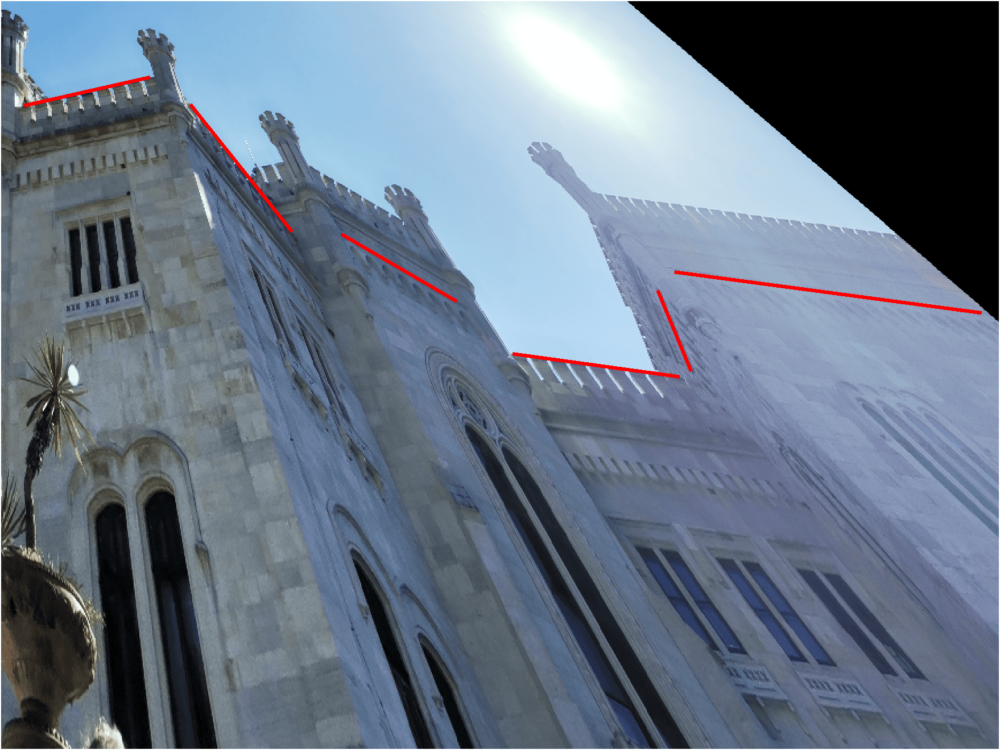
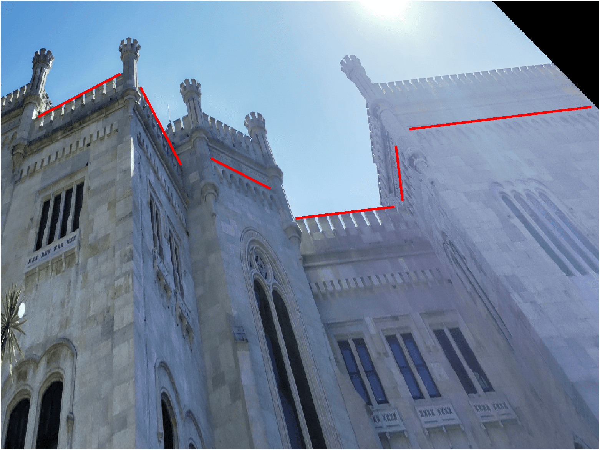
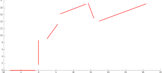

# IACV homework

## Geometry

### G1 - 2D reconstruction

#### Recovery of the affine properties

To recover the affine properties of the images we have to put back the line at infinity in the image to its canonical position $\begin{bmatrix}0&0&1\end{bmatrix}^T$.
In order to do it we need to compute the infinity line for the plane $\Pi$ in the image, on this line lie all the vanish point s given by the parallel lines of the plane $\Pi$. So, I choice to compute the vanish points for the facade on which there are the line segments 2, 3 and 5 (the vanish point of the facades 1, 4 and 6  would introduce too much uncertainty, because the lines lie on them are almost parallel).

So I selected some lines parallel to plane $\Pi$ on the facades 2, 3 and 5; for each plane I created an instance of `SegGroup` to group the parallel line segments. With the method `find_vanish_point` I retrieve the vanish points corresponding to the three lines groups.

{height=250px}

The `find_vanish_point` sets the problem to find the vanish point as a minimization one. We know that a point $p$ on a line $l$ solves the relation $l^Tp=0$, thus the lines are collected in a matrix $L=\begin{bmatrix}l_1 & l_2 & \dots\end{bmatrix}^T$ where the best approximation fot the vanish point is the point $v$ that minimize the relation $\lVert Lv \rVert$.
The point $v$ that minimize the error is found exploiting the *least squares solution of homogeneus equation*  as the last column of the matrix $V$ getting from the *singular value decomposition* of the matrix $L$.
*In order to reduce the error given by the `svd` function, the line coordinates are normalized rescaling them around zero.*

 

Found the 3 vanish points I use them to find the infinity line in the image, which have to pass to all the three vanish points. Due to the noise the infinity line cannot satisfy the relation $v l_\infty = 0$ for all the three vanish points, so I set also the problem to find infinity line as a minimization one. In this case I grouped the vanish points in a matrix $V = \begin{bmatrix}v_2 & v_3 & v_5\end{bmatrix}^T$ looking for the line $l_\infty$ which minimize $\lVert V l_\infty \rVert$.
Also to solve this minimization problem I used the `svd` function after the data were been normalized to reduce errors.

The homography to restore the affinity property can be written as

$$
H_p = \begin{bmatrix}
        1 & 0 & 0 \\
        0 & 1 & 0 \\
          & l_\infty^T &   \\
\end{bmatrix}
$$

Apply the homography to the image we can restore the affine properties. 

{height=250px}

#### Recovery of the metric properties

In order to recover the metric properties we can exploit the line infinity conic $C_\infty^\ast$.
We have to put back this line conic to its canonical position, do to that we can exploit the relation $l^T C_\infty^\ast m = 0$ where $l$ and $m$ are two orthogonal lines.
The $C_\infty^\ast$ after an affine rectification has the  form

$$
C_\infty^\ast =\begin{bmatrix}
    KK^T & 0  \\
    0^T & 0 \\
\end{bmatrix} \qquad
KK^T = \begin{bmatrix}
s_1 & s_2  \\
s_2 & s_3 \\
\end{bmatrix} = S
$$

So the previously seen constraint can be written as $a^T s = 0$ where $a=\begin{bmatrix}l_1 m_1 & l_1 m_2 + l_2 m_1 & l_2 m_2\end{bmatrix}^T$ and $s=\begin{bmatrix}s_1 & s_2 & s_3\end{bmatrix}^T$.
$s$ can be found solving the system $A^T s = 0$ where $A$ is a matrix which columns are composed by the relation $a(l,m)$ for at least 2 couples of orthogonal lines, but because we have 3 couples of orthogonal lines in the plane $\Pi$ (1-2, 4-5, 5-6) it is useful set the problem to find $s$ as an optimization one. The problem to minimize $\lVert A^Ts \rVert$ can be solved exploiting the `svd` method.

Gotten $S$ and thus $C_\infty^\ast$ we can find the homography that put back this conic to its canonical position under the relation $\bar C_\infty^\ast = H_A C_\infty^\ast H_A^T$ where $\bar C_\infty^\ast$ is the canonical infinity line conic.
$H_A$ can be gotten exploiting SVD of $C_\infty^\ast$ (because of $C_\infty^\ast$ have last column and last row equal to zero is better to decompose $S$) as $H_A^{-1} = U*\sqrt{D} * V^T + diag(0, 0, 1)$.

*Affinity transformation may include a mirror effect, so I decide to remove this effect to re-orientate the image in the original orientation if this effect appears.*

{height=250px}

#### Fix a reference frame on $\Pi$

To better evaluate the points on plane $\Pi$ I decided to compute a further similar transformation to assign an arbitrary reference frame on $\Pi$.
I chose to put the reference frame at the intersection of the lines 1 and 2, with y-axis aligned with the line 2 and with z-axis headed to the sky;
first I applied a translation to define the new origin, then I calculated the rotation matrix to align the line $2$ to the y-axis, and as last step I rescaled the points to meter unit exploiting an approximate measure of the segment $5$ gotten from internet. 

{height=250px}