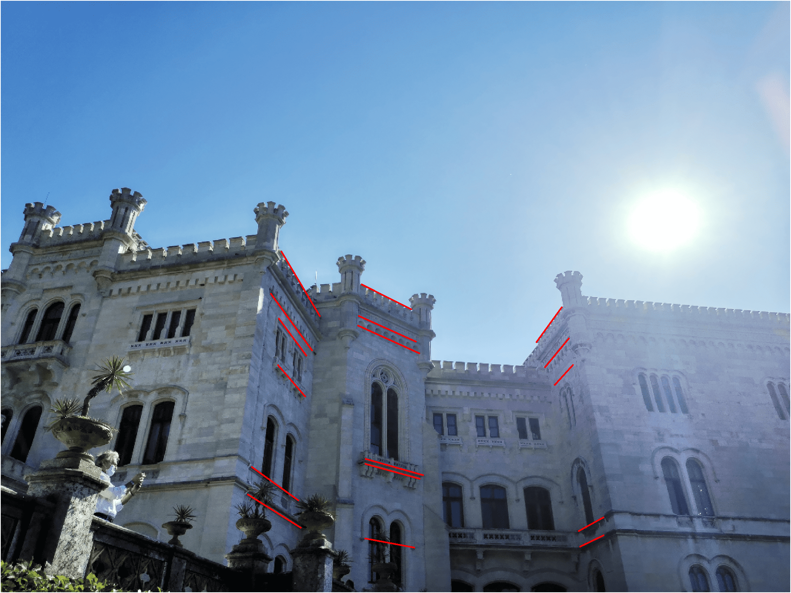
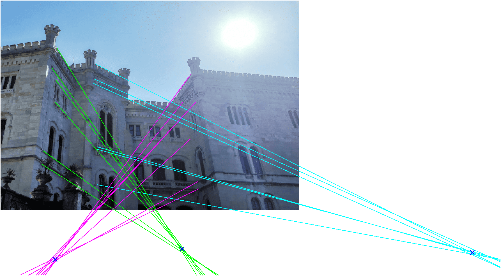
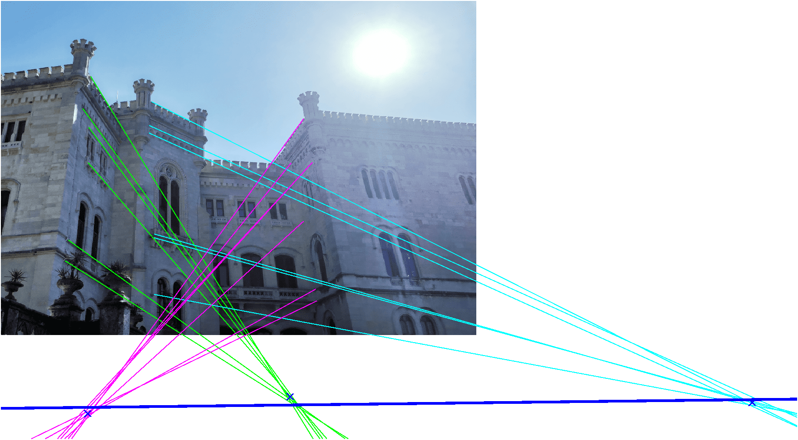

# IACV homework

## Geometry

### G1 - 2D reconstruction

#### Recovery of affine property

To recover the affine properties of the images we have to put back the line at infinity in the image to its canonical position $\begin{bmatrix}0&0&1\end{bmatrix}'$.
In order to do it we need to compute the infinity line for the plane $\Pi$ in the image, on this line lie all the vanish point s given by the parallel lines of the plane $\Pi$. So, I choice to compute the vanish points for the facade on which there are the line segments 2, 3 and 5 (the vanish point of the facades 1, 4 and 6  would introduce too much uncertainty, because the lines lie on them are almost parallel).

So I selected some lines parallel to plane $\Pi$ on the facades 2, 3 and 5; for each plane I created an instance of `SegGroup` to group the parallel line segments. With the method `find_vanish_point` I retrieve the vanish points corresponding to the three lines groups.

{height=250px}

The `find_vanish_point` sets the problem to find the vanish point as a minimization one. We know that a point $p$ on a line $l$ solves the relation $l'p=0$, thus the lines are collected in a matrix $L=\begin{bmatrix}l_1'&l_2'&\dots\end{bmatrix}'$ where the best approximation fot the vanish point is the point $v$ that minimize the relation $\lVert Lv \rVert$.
The point $v$ that minimize the error is found exploiting the *least squares solution of homogeneus equation*  as the last column of the matrix $V$ getting from the *singular value decomposition* of the matrix $L$.
*In order to reduce the error given by the `svd` function, the line coordinates are normalized rescaling them around zero.*

 

Found the 3 vanish points I use them to find the infinity line in the image, which have to pass to all the three vanish points. Due to the noise the infinity line cannot satisfy the relation $v l_\infty = 0$ for all the three vanish points, so I set also the problem to find infinity line as a minimization one. In this case I grouped the vanish points in a matrix $V = \begin{bmatrix}v_2'&v_3'&v_5'\end{bmatrix}'$ looking for the line $l_\infty$ which minimize $\lVert V l_\infty \rVert$.
Also to solve this minimization problem I used the `svd` function after the data were been normalized to reduce errors.

The homography to restore the affinity property can be written as

$$
H_p = \begin{bmatrix}
        1 & 0 & 0 \\
        0 & 1 & 0 \\
          & l_\infty' &   \\
\end{bmatrix}
$$

Apply the homography to the image we can restore the affine properties. 

{height=250px}

